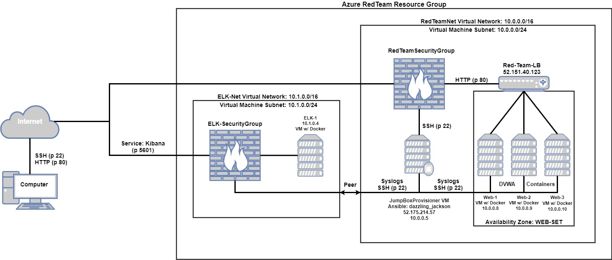
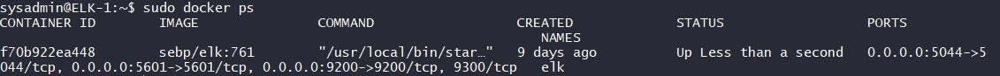

## Automated ELK Stack Deployment

The files in this repository were used to configure the network depicted below.



These files have been tested and used to generate a live ELK deployment on Azure. They can be used to either recreate the entire deployment pictured above. Alternatively, select portions of the playbook file may be used to install only certain pieces of it, such as Filebeat.

This document contains the following details:
- Description of the Topology
- Access Policies
- ELK Configuration
- Target Machines & Beats 
- Using the Playbook 
- YAMAL Playbook Setup  
- Commands to Download and Run Playbook


### Description of Topology

The main purpose of this network is to expose a load-balanced and monitored instance of DVWA, the D*mn Vulnerable Web Application.

Load balancing ensures that the application will be highly available, in addition to restricting inbound access to the network. In addition, an important security aspect of load balancers is its ability to defend against distributed denial-of-service (DDoS) attacks, thus, further increasing the network's reliability. A Jump Box virtual machine is used as the single node of access and control to all other virtual machines within the network. This provides the benefits of only having to secure and monitor a single access point; fanning in.  

Integrating an ELK server allows users to easily monitor the vulnerable VMs for changes to the file systems of the VMs on the network and system metrics, such as CPU usage, attampted SSH logins, sudo esclation failures, and etc. In this ELK Stack, Filebeat will be used to collect data about file systems and Metricbeat will be used to collect machine metrics.

The configuration details of each machine may be found below.

|        Name        |  Function | IP Address | Operating System |
|:------------------:|:---------:|:----------:|:----------------:|
| JumpBoxProvisioner |  Gateway  |  10.0.0.5  |       Linux      |
| Web-1              | Webserver |  10.0.0.8  |       Linux      |
| Web-2              | Webserver |  10.0.0.9  |       Linux      |
| Web-3              | Webserver |  10.0.0.10 |       Linux      |
| Elk-1              |  Monitor  |  10.1.0.4  |       Linux      |


### Access Policies

The machines on the internal network are not exposed to the public Internet. 

Only the JumpBoxProvisioner machine can accept connections from the Internet. Access to this machine is only allowed from the following IP addresses:
- 76.174.216.209

Machines within the network can only be accessed by each other. The JumpBoxProvisioner with IP Address 10.0.0.5 is allowed access to the ELK-1 machine as well.

A summary of the access policies in place can be found in the table below.

|        Name        | Publicly Accessible |   Allowed IP Addresses  |
|:------------------:|:-------------------:|:-----------------------:|
| JumpBoxProvisioner |         Yes         |      76.174.216.209     |
| ELK-1              |         Yes         |      76.174.216.209     |
| Web-1              |          No         | 10.0.0.0/24 10.0.0.0/24 |
| Web-2              |          No         | 10.0.0.0/24 10.1.0.0/24 |
| Web-3              |          No         | 10.0.0.0/24 10.1.0.0/24 |
| Elk-1              |          No         | 10.0.0.0/24 10.1.0.0/24 |


### Elk Configuration

Ansible was used to automate configuration of the ELK machine. No configuration was performed manually, which is advantageous because it saves a significant amount of time.

The playbook implements the following tasks:
- use apt module to install docker.io
- use apt module to install python3-pip
- use pip module to install docker module
- use command module to increase virtual memory
- use sysctl module to use more memory
- use docker_container module to download and launch a docker elk container

The following screenshot displays the result of running `docker ps` after successfully configuring the ELK instance.




### Target Machines & Beats
This ELK server is configured to monitor the following machines:
- Web-1 - 10.0.0.5
- Web-2 - 10.0.0.8
- Web-3 - 10.0.0.9

We have installed the following Beats on these machines:
- filebeat
- metricbeat

These Beats allow us to collect the following information from each machine:
- filebeat: Collects data about the file system and forwards them to Elasticsearch or Logstash for indexing.
- metricbeat: Collects machine metrics such as CPU, memory, uptime, and etc.


### Using the Playbook
In order to use the playbook, you will need to have an Ansible control node already configured. Assuming you have such a control node provisioned: 

SSH into the control node and follow the steps below:
- Copy the ELK_server_c-playbook.yml file to the Ansible control node (Ansible container).
- Update the hosts file to include:

[webservers]
10.0.0.5 ansible_python_interpreter=/usr/bin/python3
10.0.0.8 ansible_python_interpreter=/usr/bin/python3
10.0.0.9 ansible_python_interpreter=/usr/bin/python3

[elk]
10.1.0.4 ansible_python_interpreter=/usr/bin/python3

- Run the playbook, and navigate to "<enter ELK-1 Private IP Address>:5601/app/kibana" via web browser to check that the installation worked as expected.


### YAMAL Playbook Setup
```console
---
- name: Installing and Launch Filebeat
  hosts: webservers
  become: yes
  tasks:
    # Use command module
  - name: Download filebeat .deb file
    command: curl -L -O https://artifacts.elastic.co/downloads/beats/filebeat/filebeat-7.6.1-amd64.deb

    # Use command module
  - name: Install filebeat .deb
    command: sudo dpkg -i filebeat-7.6.1-amd64.deb

    # Use copy module
  - name: Drop in filebeat.yml
    copy:
      src: /etc/ansible/files/filebeat-config.yml
      dest: /etc/filebeat/filebeat.yml

    # Use command module
  - name: Enable and Configure System Module
    command: filebeat modules enable system

    # Use command module
  - name: Setup filebeat
    command: filebeat setup

    # Use command module
  - name: Start filebeat service
    command: service filebeat start
```


 ### Commands to Download and Run Playbook
```console
- mkdir files
- git clone https://github.com/mattkchao/Azure_ELK_Infrastructure.git
- cp files/* /etc/anisble/
- cd /etc/ansible/
- nano hosts
  Example:
    [webservers]
    10.0.0.11 ansible_python_interpreter=/usr/bin/python3
    10.0.0.9 ansible_python_interpreter=/usr/bin/python3
    10.0.0.12 ansible_python_interpreter=/usr/bin/python3
 - ansible-playbook DVWA_yaml_config.yml
 - ansible-playbook install_elk.yml
 - ansible-playbook install_filebeat.yml
 - ansible-playbook install_metricbeat.yml
```